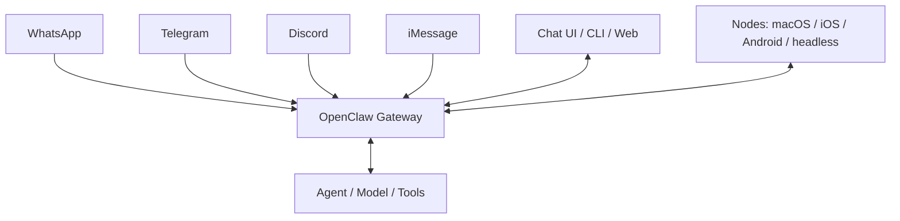
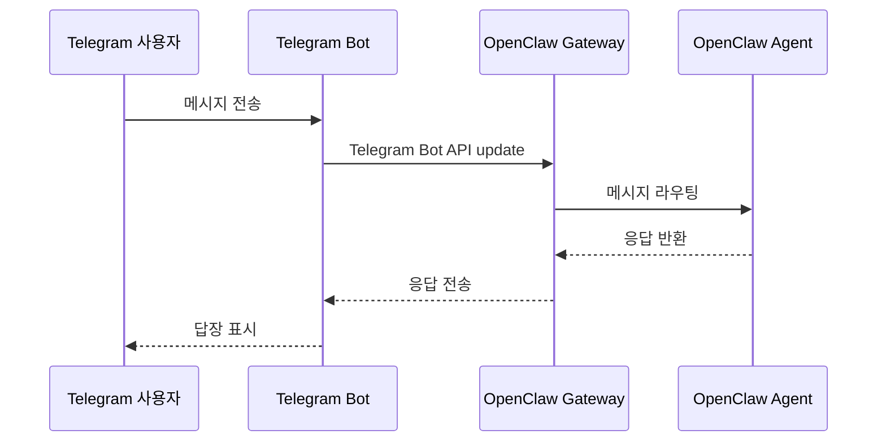
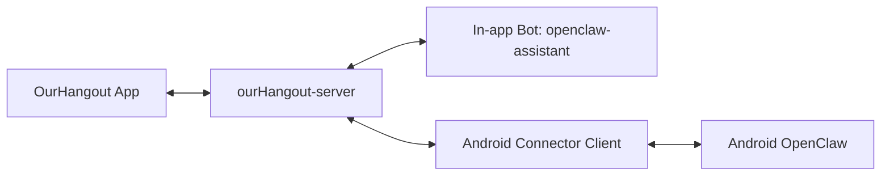
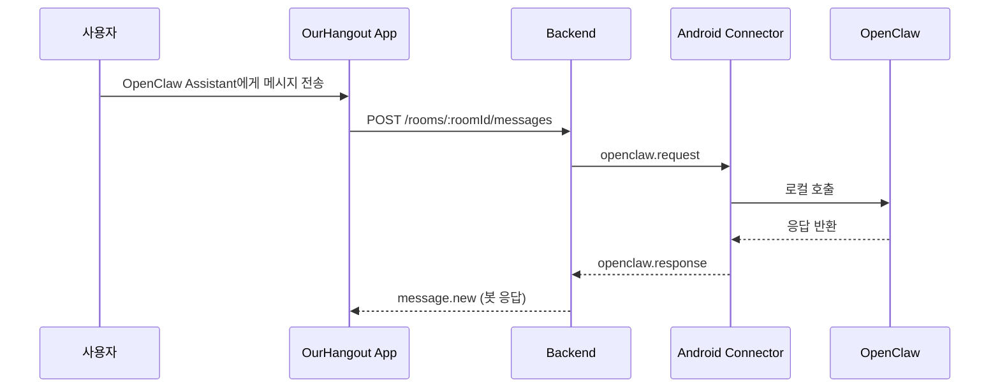
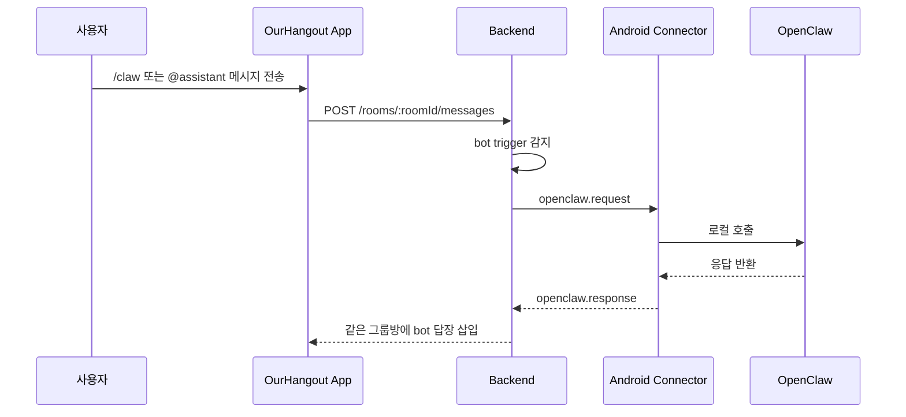
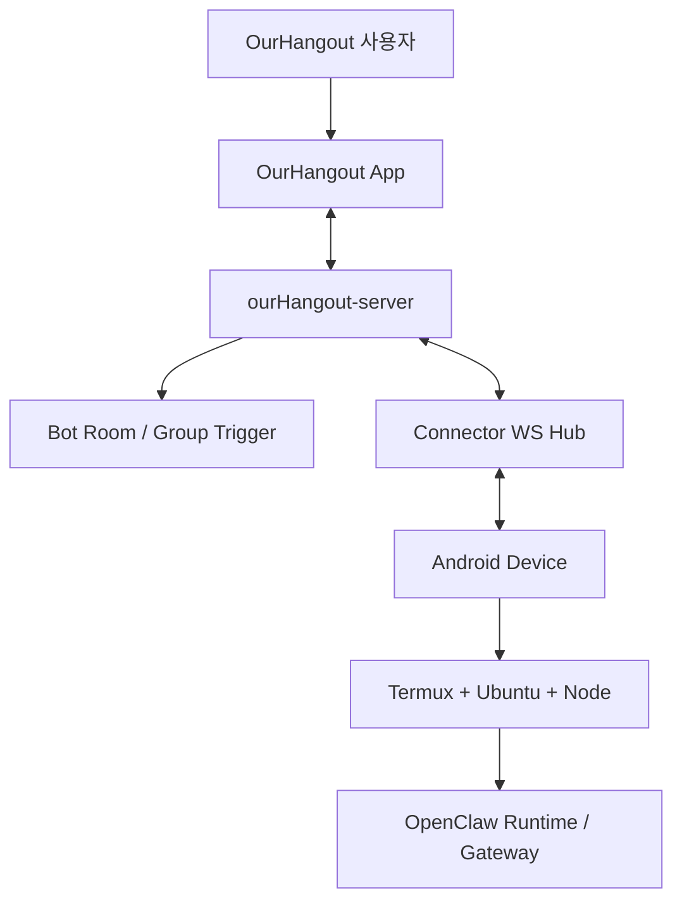

# OpenClaw Android 연계 가이드

## 1. 문서 목적

이 문서는 아래 내용을 정리합니다.

- OpenClaw의 전체 아키텍처 설명
- OpenClaw가 Telegram과 연계될 때의 구조 설명
- OurHangout에서 텔레그램식 외부 봇이 필요한지 여부
- Android에서 Termux/Ubuntu/Node 기반으로 OpenClaw를 돌릴 때 연계 가능성
- 현재 `ourHangout-server`를 OpenClaw 브리지로 사용할 수 있는지
- 실제 적용 시 어떤 구조와 흐름으로 동작해야 하는지

대상 코드베이스:

- 앱: `ourHangout`
- 백엔드: `ourHangout-server`

## 2. 결론 요약

짧게 정리하면:

- **텔레그램 외부 봇은 필요 없습니다**
- 하지만 **앱 내부에서는 봇 개념이 필요합니다**
- 현재 저장소 기준으로 가장 잘 맞는 구조는:
  - `OurHangout App` = 사용자 채팅 앱
  - `ourHangout-server` = OpenClaw 브리지 + 봇 오케스트레이션
  - `Android OpenClaw` = 실제 AI 실행 환경

권장 방향:

1. OpenClaw를 OurHangout 안의 **대화 참여자(bot)** 로 취급
2. 현재 백엔드의 **bot room + connector** 구조를 활용
3. OpenClaw가 Android에서 Termux/Ubuntu/Node로 실행된다면 **connector client**를 통해 연결
4. Telegram을 거쳐서 우회하지 말고 OurHangout 내부 흐름으로 직접 연결

## 3. OpenClaw 아키텍처 설명

OpenClaw 공식 문서는 **Gateway 중심 구조**를 설명합니다.

핵심 개념:

- 여러 채널이 하나의 Gateway에 연결됨
- 클라이언트와 노드가 Gateway와 통신함
- Gateway가 채널 세션과 제어 흐름을 관리함

### 3.1 OpenClaw 전체 구조

의미:

- Telegram도 여러 입력 채널 중 하나일 뿐입니다
- Gateway가 장시간 떠 있으면서 채널 세션을 소유합니다
- 개별 앱이나 노드는 Telegram과 직접 대화하지 않습니다
- 모두 Gateway와 연결됩니다

### 3.2 이 구조가 OurHangout에 의미하는 것

OurHangout이 Telegram을 흉내 낼 필요는 없습니다.

현실적인 연결 방식은 두 가지입니다.

1. `ourHangout-server`가 OpenClaw와의 **브리지/어댑터** 역할을 수행
2. OurHangout이 OpenClaw Gateway의 새로운 채널처럼 직접 붙음

현재 저장소 기준으로는 1번이 훨씬 현실적이고 안전합니다.

## 4. OpenClaw의 Telegram 연계는 어떻게 동작하는가

Telegram 연계는 전형적인 **채널 통합(channel integration)** 입니다.

- Telegram 사용자는 Telegram bot과 대화합니다
- OpenClaw Gateway가 Telegram bot token과 채널 세션을 관리합니다
- Telegram에서 들어온 메시지를 Gateway가 받습니다
- Gateway가 agent로 라우팅합니다
- agent 응답을 다시 Telegram으로 돌려보냅니다

### 4.1 Telegram 흐름 도식

핵심:

- Telegram 연계는 **Telegram 채널용 봇을 Gateway가 관리하는 구조**
- OurHangout은 이 Telegram 봇 구조를 그대로 따라갈 필요는 없습니다

## 5. OurHangout에 봇이 필요한가

### 5.1 외부 Telegram Bot이 필요한가

아닙니다.

필요 없는 것:

- Telegram bot 계정
- Telegram Bot API 직접 연동
- 사용자 경험을 Telegram으로 우회시키는 구조

### 5.2 앱 내부 봇 개념은 필요한가

필요합니다.

이유:

1. 사용자가 대화할 상대를 명확히 이해할 수 있음
2. 그룹방에서 AI를 명시적으로 호출할 수 있음
3. 권한/라우팅/기록 관리가 쉬워짐
4. 현재 백엔드 구조와 이미 잘 맞음

현재 백엔드에 이미 있는 것:

- 기본 봇 자동 생성
- 봇 전용 대화방
- OpenClaw 브리지 전달
- 그룹방 `/bot`, `/claw`, `@bot` 트리거

관련 파일:

- `src/modules/bots/bot.service.ts`
- `src/modules/social/social.service.ts`
- `docs/OPENCLAW_CONNECTOR_PROTOCOL.md`
- `README.md`

## 6. 현재 ourHangout-server가 이미 가진 준비 상태

이 백엔드는 이미 OpenClaw 연계를 위한 구조를 일부 갖고 있습니다.

### 6.1 이미 있는 요소

1. 기본 인앱 봇
- `openclaw-assistant`

2. 봇 목록/봇방 생성 API
- `GET /v1/bots`
- `POST /v1/bots/:botId/rooms`

3. OpenClaw provider 추상화
- `mock`
- `http`
- `connector`

4. connector websocket hub
- backend -> connector: `openclaw.request`
- connector -> backend: `openclaw.response`

5. 그룹방 trigger 로직
- slash command
- mention

### 6.2 이게 의미하는 것

현재 저장소는 이미 다음 방향으로 설계돼 있습니다.

- OurHangout 사용자는 앱 내부의 봇과 대화한다
- 백엔드가 OpenClaw와 통신한다
- OpenClaw는 OurHangout 앱 자체를 몰라도 된다

즉, 구조 방향은 이미 맞습니다.

## 7. Android OpenClaw + Termux/Ubuntu/Node 전제

### 7.1 OpenClaw Android에 대한 현실적 해석

공식 Android 문서는 기본적으로 OpenClaw Android를 **Gateway에 붙는 companion app** 성격으로 설명합니다.

즉 공식 기본 시나리오는:

- Gateway는 다른 어딘가에 떠 있음
- Android는 여기에 접속하는 쪽

하지만 실제 운영에서는 Android에:

- Termux
- Ubuntu in proot
- Node.js

를 올려서 장시간 프로세스를 띄우는 경우가 많습니다.

그 경우 실질적으로는:

- Android에서 `openclaw gateway`를 직접 돌리거나
- Android에서 connector process를 돌려 로컬 OpenClaw runtime을 호출하는 방식

이 가능합니다.

### 7.2 가능한 조건

Android OpenClaw 연계가 현실적으로 가능하려면 아래 중 하나는 있어야 합니다.

1. 로컬 HTTP API 제공
2. 로컬 CLI 호출 가능
3. connector process가 같은 런타임 안에서 직접 import/use 가능

반대로 Android OpenClaw가 단순 UI 앱이고 외부 호출 인터페이스가 없으면 연계는 불안정합니다.

## 8. connector 방식이 가능한가

가능합니다.  
그리고 현재 저장소에 가장 잘 맞는 방식도 connector입니다.

### 8.1 우리가 원하는 모델

사용자 관점:

- OurHangout에서 bot이 보인다
- OpenClaw는 그 bot으로 대화에 참여한다

이건 현재 connector 구조와 정확히 맞습니다.

### 8.2 connector 기반 구조

해석:

- 사용자는 OurHangout 안에서 bot을 본다
- bot 대상 메시지는 backend가 connector로 보낸다
- connector가 Android OpenClaw를 호출한다
- OpenClaw 응답은 다시 채팅 메시지로 돌아온다

### 8.3 Telegram 우회보다 좋은 이유

장점:

1. UX가 OurHangout 안에 머문다
2. Telegram 의존이 없다
3. 방 상태, 기록, 권한, 신고/관리 모두 backend가 통제한다
4. 친구방/그룹방과 자연스럽게 섞을 수 있다

## 9. 권장 연계 모드

### 모드 A. 전용 OpenClaw 봇방

사용자는:

- `OpenClaw Assistant`

와 1:1 방에서 대화합니다.

이 모드가 좋은 이유:

- 첫 구현에 가장 안전함
- 사용자가 이해하기 쉬움
- 오류 지점이 적음

흐름:

### 모드 B. 그룹방 mention/command 호출

사용자는 가족/그룹방 안에서:

- `/claw 오늘 일정 요약해줘`
- `@openclaw-assistant 이 대화 요약해줘`

처럼 호출합니다.

좋은 점:

- 가족 대화 안에 AI를 자연스럽게 섞을 수 있음

흐름:

### 모드 C. OurHangout을 OpenClaw의 채널로 직접 구현

기술적으로는 가능하지만, 현재 시점엔 권장하지 않습니다.

이유:

- 구현 면적이 커짐
- OpenClaw 내부 채널 프로토콜과 더 강하게 결합됨
- 현재 저장소는 이미 bot room + connector 구조가 준비돼 있음

## 10. OurHangout + OpenClaw 권장 구조

### 10.1 런타임 토폴로지

### 10.2 실제 요청 흐름

1. 사용자가 메시지를 보냄
2. backend가 room history에 저장
3. backend가 이 메시지가 OpenClaw 대상인지 판별
4. backend가 `openclaw.request` 발행
5. Android connector가 수신
6. connector가 Android OpenClaw를 로컬 호출
7. connector가 `openclaw.response` 반환
8. backend가 AI 응답을 일반 채팅 메시지로 저장
9. 앱은 websocket/push로 응답을 받음

### 10.3 사용자 경험

사용자는 이 과정을:

- 봇과 대화한다
- 혹은 그룹방에서 AI가 끼어든다

정도로만 느끼게 됩니다.

즉, OpenClaw 내부 구조를 몰라도 됩니다.

## 11. 가능 여부 체크리스트

연계가 가능한 조건:

1. Android OpenClaw에 local HTTP API가 있음
2. Android OpenClaw를 CLI로 호출 가능
3. connector process가 같은 Node 런타임 안에서 직접 사용 가능

위험도:

- local API 있음: 낮음
- CLI만 있음: 중간
- UI 앱만 있고 API/CLI 없음: 높음

### 11.1 운영 리스크

1. Android background 제약
- Termux 프로세스가 죽을 수 있음

2. 배터리 최적화
- 제조사별 aggressive kill 가능

3. OpenClaw 프로세스 관리
- gateway/connector 재시작 전략 필요

4. connector 신뢰성
- websocket reconnect
- idempotent request 처리

## 12. 구현 단계 제안

### 1단계. 전용 봇방

목표:

- `OpenClaw Assistant`와 1:1 대화 가능

작업:

1. Android 쪽 호출 방식 확인
2. Android/Termux connector client 구현
3. backend를 `OPENCLAW_MODE=connector`로 동작
4. bot room 왕복 검증

### 2단계. 그룹방 trigger

목표:

- 그룹방에서 명시적 호출 시 OpenClaw 응답

작업:

1. trigger rule 정교화
2. 과호출 방지
3. AI 호출 힌트 UI 추가

### 3단계. UX 정교화

목표:

- AI가 앱 안에 자연스럽게 녹아드는 경험

작업:

1. bot 아바타/배지
2. typing indicator
3. streaming 또는 chunked reply 고려
4. 실패 시 재시도/오프라인 안내

## 13. 예시 시나리오

### 예시 A. 아이가 숙제를 물어봄

1. 아이가 `OpenClaw Assistant` 방을 염
2. `분수를 쉽게 설명해줘` 입력
3. backend가 Android OpenClaw로 전달
4. OpenClaw 응답
5. 같은 방에 bot 메시지로 표시

### 예시 B. 가족 그룹에서 요약 요청

1. 부모가 그룹방에 `/claw 내일 일정 요약해줘` 입력
2. backend가 bot trigger 감지
3. connector가 Android OpenClaw 호출
4. 응답이 같은 그룹방에 삽입

### 예시 C. bot unavailable

1. 사용자가 bot에게 메시지 전송
2. connector가 offline
3. backend가 provider unavailable 처리
4. 앱이 bot unavailable 안내를 표시

## 14. 최종 권장안

현재 저장소 기준 최적의 구조는:

- **인앱 bot 모델 유지**
- **Telegram 의존 제거**
- **backend connector mode 사용**
- **Android OpenClaw 옆에 connector client 실행**

이 방식이 가장 잘 맞는 이유:

1. 현재 backend 코드 재사용 가능
2. 현재 room/message 모델과 자연스럽게 맞음
3. 사용자 경험이 OurHangout 안에 머묾
4. Android + Termux + Node 운영 현실과도 맞음

## 15. 참고 소스

공식/주요 참고:

- OpenClaw docs home: https://openclaw.cc/en/
- OpenClaw architecture: https://openclaw.cc/concepts/architecture
- OpenClaw Android docs: https://openclaw.cc/en/platforms/android
- OpenClaw Telegram docs: https://openclaw.cc/en/channels/telegram

현재 저장소 참고:

- `README.md`
- `docs/OPENCLAW_CONNECTOR_PROTOCOL.md`
- `src/modules/social/social.service.ts`
- `src/modules/bots/bot.service.ts`
- `src/modules/openclaw/provider.factory.ts`
- `src/modules/openclaw/connector.provider.ts`

## 16. 다음 단계에서 반드시 확인할 한 가지

실제 구현 전에 Android 쪽에서 아래 질문 하나를 먼저 확정해야 합니다.

> "Android OpenClaw를 connector가 로컬에서 어떻게 호출할 것인가?"

선택지:

1. local HTTP
2. local CLI
3. in-process Node module

이 한 가지가 정해지면, 이후 구현은 비교적 깔끔하게 진행할 수 있습니다.
