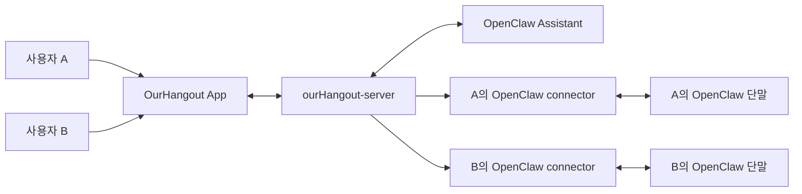
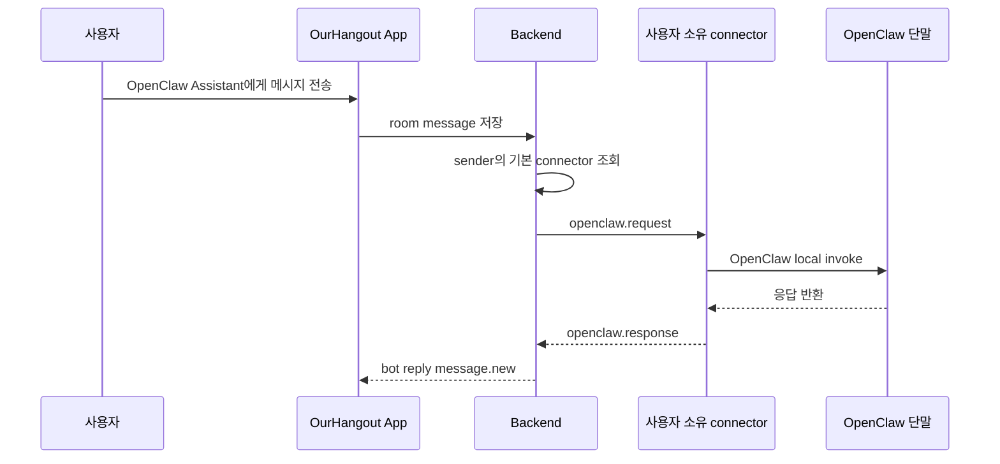
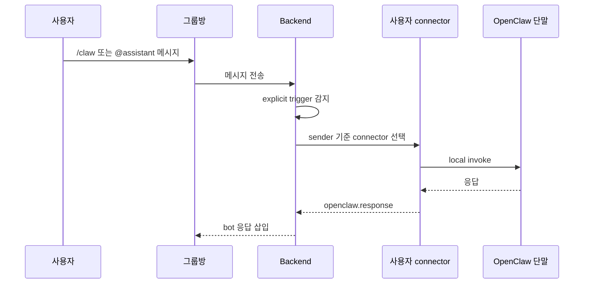
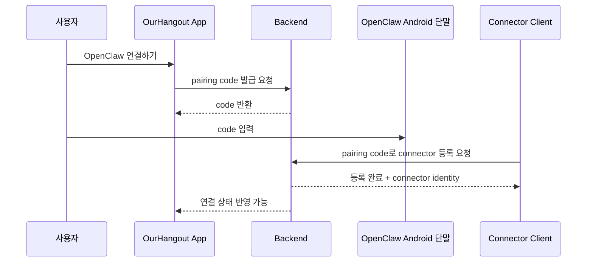

# OpenClaw 사용자별 Connector 설계 문서

## 1. 문서 목적

이 문서는 아래 상황을 기준으로 설계 방향을 정리합니다.

- `OurHangout` 앱은 일반 메신저로도 동작해야 함
- 사용자는 원하면 자신의 OpenClaw를 연결해서 AI 기능을 사용하고 싶어 함
- OpenClaw는 OurHangout 앱이 설치된 단말과 **별도 Android 단말**에서 구동될 수 있음
- Telegram bot처럼 대화형으로 동작하되, 실제 외부 플랫폼 Telegram에 의존하지 않고 OurHangout 안에서 동작해야 함

이 문서는 다음을 설명합니다.

- OpenClaw와 Telegram 연계 모델을 참고했을 때 어떤 UX가 맞는지
- 왜 `공용 bot`만으로는 부족하고 `사용자 소유 connector`가 필요한지
- OurHangout에서 가장 유연한 UX 구조
- backend / app / connector 관점의 권장 설계

## 2. 핵심 결론

짧게 정리하면:

1. **앱은 기본적으로 일반 메신저여야 한다**
2. **OpenClaw 연결은 선택 기능이어야 한다**
3. **사용자는 자기 OpenClaw를 연결할 수 있어야 한다**
4. **겉으로는 공용 bot처럼 보이되, 실제 라우팅은 사용자별 connector로 가야 한다**
5. **Telegram bot과 비슷한 UX는 참고하되, Telegram 자체를 붙일 필요는 없다**

즉:

- 사용자 UX: `OpenClaw Assistant` 같은 봇과 대화
- 내부 구조: `user-owned connector`

이게 가장 유연합니다.

## 3. Telegram을 참고했을 때 얻을 수 있는 UX 원칙

Telegram에서 봇은 보통 아래처럼 사용됩니다.

1. 개인방에서 직접 bot과 대화
2. 그룹방에서는 명시적 호출(`/command`, `@bot`)
3. bot이 항상 끼어드는 것이 아니라 **불렸을 때만** 반응

이 UX 원칙은 OurHangout에도 잘 맞습니다.

### 3.1 Telegram식 참고 포인트

- 개인방: AI와 1:1 대화
- 그룹방: 명시적 호출형
- 일반 대화는 AI가 방해하지 않음
- 사용자는 “이건 bot과의 대화”라고 쉽게 이해 가능

## 4. 왜 `공용 bot + 공용 connector`로는 부족한가

현재 단순 모델:

- 봇 하나
- connector 하나 또는 여러 connector 중 하나
- botKey 기준으로 라우팅

이 모델의 문제:

1. A 사용자의 요청이 B 사용자의 OpenClaw로 갈 수 있음
2. 사용자마다 다른 OpenClaw 설정을 가질 수 없음
3. “내 OpenClaw”라는 개념이 없음
4. 운영상 어느 단말이 어떤 사용자의 AI인지 구분이 어려움

즉, 아래와 같은 요구를 못 만족합니다.

- “나는 내 OpenClaw를 붙여서 쓰고 싶다”
- “다른 사람은 자기 OpenClaw를 붙여 쓰고 싶다”
- “OpenClaw를 연결하지 않은 사용자는 그냥 메신저만 쓰고 싶다”

## 5. 권장 모델: 공용 bot UI + 사용자 소유 connector

겉으로는:

- 모두가 `OpenClaw Assistant`라는 봇을 본다

속으로는:

- 각 사용자의 메시지는 **그 사용자의 connector**로 라우팅된다

### 5.1 개념도



해석:

- bot은 UI/제품 관점에서 공용 개념
- 실제 실행기는 사용자별 connector

## 6. 앱 UX 제안

### 6.1 연결하지 않은 사용자

앱은 그냥 일반 메신저처럼 동작합니다.

보이는 것:

- 친구
- 대화
- 프로필

AI 관련 UI:

- 아예 숨기거나
- `OpenClaw 연결하기` 정도의 작은 CTA만 보여주기

즉, 기본 메신저 경험을 해치면 안 됩니다.

### 6.2 OpenClaw를 연결한 사용자

이 사용자는 추가 기능이 열립니다.

예:

- 채팅 탭 상단에 `도우미`
- `OpenClaw Assistant` bot room 생성
- 그룹방에서 `/claw`, `@assistant` 사용 가능

### 6.3 권장 화면 구조

#### 프로필/설정

추가 섹션:

- `OpenClaw 연결`
- 상태: `연결 안 됨 / 연결됨 / 끊김`
- 연결 이름
- 마지막 접속 시간
- 기본 OpenClaw로 사용
- 연결 해제

#### 대화 탭

연결 안 된 사용자:

- 기존 대화 목록만 노출
- 필요하면 `OpenClaw 연결하기` CTA

연결된 사용자:

- 상단 `도우미` 섹션
- `OpenClaw Assistant`
- 탭하면 bot room 진입

#### 그룹방

처음에는 항상 AI가 반응하지 않게 합니다.

허용 방식:

- `/claw`
- `@openclaw-assistant`

즉, 명시적 호출형

## 7. 권장 사용자 상태 모델

사용자 상태는 아래 3가지로 나눌 수 있습니다.

### 상태 A. 미연결

- 일반 메신저만 사용
- AI 기능 비활성

### 상태 B. 개인 연결

- 본인 OpenClaw 단말을 연결
- direct bot room 가능
- group room AI 호출 가능

### 상태 C. 공유 연결

- 가족/팀이 공유하는 OpenClaw를 사용
- 소유자가 허용한 경우만 접근

초기 구현은 **상태 A + 상태 B**만 있어도 충분합니다.

## 8. 라우팅 정책

### 8.1 direct bot room

가장 단순한 규칙:

- bot room에서 사용자가 보낸 메시지
- -> **보낸 사용자의 default connector**

즉:

- A가 bot에게 보냄 -> A의 OpenClaw
- B가 bot에게 보냄 -> B의 OpenClaw

### 8.2 group room

권장 기본 규칙:

- `/claw`, `@assistant`를 보낸 **그 사용자**의 connector 사용

이유:

- “누가 AI를 불렀는가”가 명확
- “내 OpenClaw가 답한 것”이라는 개념이 자연스러움

### 8.3 fallback 정책

사용자의 connector가 없으면:

- AI 호출 실패 시스템 메시지
- 예: `OpenClaw가 연결되어 있지 않아요`

connector가 offline이면:

- `지금은 응답할 수 없어요. 잠시 후 다시 시도해 주세요`

## 9. backend 설계

### 9.1 중요한 원칙

- backend 상위 계층은 `bot abstraction`만 안다
- OpenClaw는 provider/connector 계층에서만 안다

즉:

- App -> bot
- SocialService -> bot routing
- Connector/Provider -> OpenClaw

### 9.2 필요한 개념

현재 단순 `botKey` 기반 라우팅만으로는 부족합니다.

추가로 필요한 정보:

- `connector_id`
- `owner_user_id`
- `device_name`
- `status`
- `last_seen_at`
- `is_default`
- `supported_bot_keys`

### 9.3 권장 테이블 예시

#### `openclaw_connectors`

```text
id
owner_user_id
connector_id
device_name
status
last_seen_at
is_default
created_at
updated_at
```

#### `openclaw_connector_bot_keys`

```text
connector_id
bot_key
```

또는 하나의 테이블에 JSON/array로 넣을 수도 있지만, 초기엔 단순화해도 됩니다.

### 9.4 pairing / 연결 절차

권장 흐름:

1. OurHangout 앱에서 `OpenClaw 연결하기`
2. backend가 pairing token 또는 one-time code 발급
3. OpenClaw 단말의 connector가 이 code를 사용해 등록
4. backend가 connector를 해당 사용자 소유로 연결

### 9.5 connector websocket 인증

현재 단순 shared token만으로는 부족합니다.

필요:

- shared connector token
- plus user binding / pairing token

즉:

- connector가 “서버에 붙는 것”과
- “누구의 connector인지”를 분리해서 봐야 합니다

## 10. OurHangout에서의 실제 동작 흐름

### 10.1 direct bot room



### 10.2 group room



## 11. 단계별 구현 계획

### 1단계. 개인 OpenClaw 연결 개념 추가

목표:

- 각 사용자가 자신의 connector를 가질 수 있게

작업:

1. connector ownership schema 추가
2. pairing/register API 추가
3. connector 상태 조회 API 추가

### 2단계. direct bot room 연결

목표:

- 사용자가 자신의 OpenClaw Assistant와 대화 가능

작업:

1. bot room 생성
2. sender -> owner connector 라우팅
3. 응답 저장/전달

### 3단계. 그룹방 explicit AI 호출

목표:

- 그룹방에서 `/claw`, `@assistant` 동작

작업:

1. trigger rule 강화
2. sender 기준 connector 라우팅
3. 실패 시 안내 메시지

### 4단계. 공유 OpenClaw

목표:

- 한 사용자의 OpenClaw를 다른 사용자에게 공유 가능

작업:

1. 공유 권한 모델
2. room-level default connector
3. 소유자 제어 정책

## 12. 권장 기본값

초기 구현에서 추천하는 선택:

1. 기본 앱은 일반 메신저
2. OpenClaw는 선택 기능
3. direct bot room 먼저
4. 그룹방은 explicit trigger만
5. direct/group 모두 sender의 connector 우선
6. connector offline 시 시스템 메시지 안내

## 13. 왜 이 구조가 좋은가

장점:

1. 일반 메신저 경험을 해치지 않음
2. OpenClaw 연결 사용자만 AI를 사용
3. 각 사용자가 자기 OpenClaw를 유지 가능
4. backend가 Telegram 같은 channel platform 역할을 수행
5. 외부 Telegram dependency 없이 동일한 UX 패턴 달성 가능

## 14. 최종 권장안

OurHangout에서는 아래 구조가 가장 유연합니다.

- 사용자에게는 `OpenClaw Assistant`라는 일반 봇처럼 보임
- 실제론 사용자별 connector에 라우팅
- OpenClaw를 연결하지 않은 사용자는 그냥 일반 메신저 사용

한 줄 요약:

> **겉으로는 공용 bot, 내부적으로는 사용자 소유 connector**

이게 현재 요구사항에 가장 잘 맞는 구조입니다.

## 15. 다음 단계 상세 설계

이번 절에서는 실제 구현 전에 합의해야 할 세부 설계를 정리합니다.

범위:

1. DB 스키마
2. connector pairing flow
3. 앱 UI 변경안

---

## 16. DB 스키마 설계안

현재 구조는:

- `bots`
- `rooms`
- `room_members`
- `room_messages`
- `device_tokens`

까지는 있지만,

- "이 connector가 누구 것인지"
- "어떤 OpenClaw 단말이 연결돼 있는지"
- "누가 기본 connector인지"

를 표현하는 모델이 없습니다.

그래서 최소한 아래 2개 테이블이 필요합니다.

### 16.1 `openclaw_connectors`

역할:

- 실제 OpenClaw 연결 단말/connector 세션의 정체성 저장

예시 컬럼:

```text
id UUID PK
owner_user_id UUID NOT NULL
connector_key TEXT NOT NULL UNIQUE
device_name TEXT
platform TEXT NOT NULL DEFAULT 'android'
status TEXT NOT NULL CHECK (status IN ('pending', 'online', 'offline', 'revoked'))
is_default BOOLEAN NOT NULL DEFAULT FALSE
last_seen_at TIMESTAMPTZ
connected_at TIMESTAMPTZ
created_at TIMESTAMPTZ NOT NULL DEFAULT NOW()
updated_at TIMESTAMPTZ NOT NULL DEFAULT NOW()
```

설명:

- `owner_user_id`: 이 connector의 소유자
- `connector_key`: OpenClaw 단말이 websocket 접속 시 자신을 식별하는 안정 키
- `device_name`: 사용자에게 보여줄 단말 이름
- `status`: 연결 상태
- `is_default`: 여러 connector가 있을 때 기본 선택 여부

### 16.2 `openclaw_connector_pairings`

역할:

- 앱에서 발급한 1회용 pairing code를 통해 connector를 사용자 계정과 묶기

예시 컬럼:

```text
id UUID PK
owner_user_id UUID NOT NULL
pairing_code TEXT NOT NULL UNIQUE
expires_at TIMESTAMPTZ NOT NULL
consumed_at TIMESTAMPTZ
connector_id UUID
created_at TIMESTAMPTZ NOT NULL DEFAULT NOW()
```

설명:

- pairing code는 앱에서 발급
- OpenClaw 단말이 이 코드를 입력/제출
- backend가 connector를 `owner_user_id`에 묶음

### 16.3 선택적으로 고려할 테이블

#### `openclaw_connector_bot_keys`

역할:

- 한 connector가 어떤 botKey를 처리할 수 있는지 저장

예시:

```text
connector_id UUID NOT NULL
bot_key TEXT NOT NULL
PRIMARY KEY (connector_id, bot_key)
```

초기에는 단일 봇(`openclaw-assistant`)만 쓸 예정이면 필수는 아닙니다.

### 16.4 room 단위 override가 필요할 때

향후 공유 OpenClaw 또는 가족 공용 OpenClaw를 넣으려면 아래 테이블도 고려할 수 있습니다.

#### `room_openclaw_bindings`

역할:

- 특정 room이 어느 connector를 우선 사용해야 하는지 지정

예시:

```text
room_id UUID PK
connector_id UUID NOT NULL
created_by UUID NOT NULL
created_at TIMESTAMPTZ NOT NULL DEFAULT NOW()
updated_at TIMESTAMPTZ NOT NULL DEFAULT NOW()
```

초기 1차 구현에서는 없어도 됩니다.

### 16.5 권장 1차 스키마

처음 구현은 이 정도가 적절합니다.

필수:

1. `openclaw_connectors`
2. `openclaw_connector_pairings`

선택:

3. `openclaw_connector_bot_keys`

보류:

4. `room_openclaw_bindings`

---

## 17. Connector Pairing Flow 설계안

이 흐름의 목적은 간단합니다.

- 앱 사용자와
- 별도 Android OpenClaw 단말의 connector

를 안전하게 1:1로 묶는 것

### 17.1 기본 흐름



### 17.2 API 제안

#### 앱 -> backend

1. `POST /v1/openclaw/pairings`
- pairing code 발급

response 예시:

```json
{
  "success": true,
  "data": {
    "pairingCode": "7H2K9P",
    "expiresAt": "2026-03-10T12:00:00.000Z"
  }
}
```

#### connector -> backend

2. `POST /v1/openclaw/connectors/register`
- pairing code 소비
- connector ownership 등록

request 예시:

```json
{
  "pairingCode": "7H2K9P",
  "connectorKey": "openclaw-android-1",
  "deviceName": "Jini OpenClaw Phone",
  "botKeys": ["openclaw-assistant"]
}
```

response 예시:

```json
{
  "success": true,
  "data": {
    "connectorId": "uuid",
    "ownerUserId": "uuid",
    "isDefault": true
  }
}
```

### 17.3 websocket 인증 방식

현재는 shared token 기반만 있습니다.

권장 구조:

1. 1차 인증: shared token
2. 2차 식별: 등록된 `connector_key`
3. 연결 후 backend가 `owner_user_id`와 매핑

즉:

- "서버에 붙을 수 있는가"
- "누구 connector인가"

를 분리해야 합니다.

### 17.4 재연결

같은 connector는 같은 `connector_key`를 사용합니다.

장점:

- 단말 재부팅 후에도 동일 connector로 인식 가능
- `last_seen_at`, `status` 갱신 가능

### 17.5 revoke / disconnect

앱에서 제공해야 하는 기능:

- 연결 해제
- 기본 connector 변경
- offline 상태 보기

서버 동작:

- `status = revoked`
- 이후 websocket 접속 차단 또는 무시

---

## 18. 앱 UI 변경안

앱은 기본 메신저를 유지해야 하므로, OpenClaw UI는 "추가 기능"처럼 보여야 합니다.

### 18.1 프로필 / 설정 화면

섹션:

`OpenClaw 연결`

노출 요소:

1. 현재 상태
- 연결 안 됨
- 연결됨
- 오프라인

2. 연결 버튼
- `OpenClaw 연결하기`

3. 연결 정보
- 단말 이름
- 마지막 연결 시간
- 기본 연결 여부

4. 관리 액션
- 기본 연결로 사용
- 연결 해제

### 18.2 채팅 탭

#### 미연결 사용자

권장:

- `도우미` 섹션 자체를 숨기거나
- 아주 작은 CTA만 노출

예:

`OpenClaw를 연결하면 AI 도우미를 사용할 수 있어요`

#### 연결된 사용자

권장:

- 채팅 탭 상단에 `도우미`
- `OpenClaw Assistant`
- 탭 시 bot room 진입

### 18.3 그룹방 UI

초기에는 AI 호출 힌트를 아주 가볍게 넣는 정도가 적절합니다.

예:

- 입력창 placeholder 아래 힌트
- `/claw 요약해줘`
- `@assistant 설명해줘`

항상 노출은 과하므로:

- 메뉴 버튼
- info drawer
- 첫 진입 안내

정도가 적절합니다.

### 18.4 연결 설정 흐름

앱에서:

1. `OpenClaw 연결하기`
2. pairing code 발급
3. code 복사 또는 QR 표시
4. OpenClaw 단말에서 code 입력
5. 연결 완료 후 상태 갱신

### 18.5 상태별 UX

#### 연결 없음

- bot room 열기 버튼 disabled 또는 숨김

#### 연결 있음

- bot room 가능
- 그룹방 trigger 가능

#### 연결 끊김

- bot room은 열리지만
- 전송 시 `현재 OpenClaw가 오프라인이에요` 안내

---

## 19. 권장 1차 구현 범위

처음엔 아래만 구현하는 것이 좋습니다.

1. 개인 connector 등록
2. 기본 connector 1개
3. direct bot room
4. sender 기준 connector 라우팅
5. offline 안내

보류:

1. 공유 OpenClaw
2. room-level connector binding
3. 여러 bot
4. 그룹방 고급 정책

---

## 20. 왜 이 설계가 좋은가

1. 일반 메신저 기능이 그대로 유지됨
2. OpenClaw는 선택 기능으로 붙음
3. 각 사용자가 자기 OpenClaw를 사용할 수 있음
4. 나중에 공유 OpenClaw로도 확장 가능
5. Telegram 스타일 UX를 내부적으로 재현하면서도 외부 플랫폼 의존이 없음

---

## 21. 다음 구현 시 우선순위

1. DB migration
2. pairing API
3. connector ownership routing
4. 앱 설정 화면에 OpenClaw 연결 섹션 추가
5. bot room sender-owned connector 적용

한 줄 정리:

> **지금은 공용 bot 모델에서 시작했지만, 제품으로 가려면 사용자 소유 connector 모델로 확장해야 한다**
